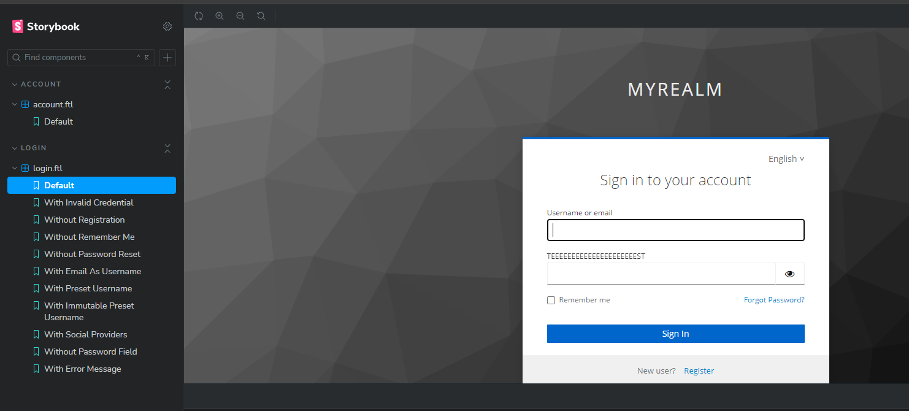
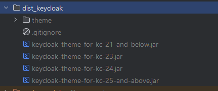

# Podstawy Keycloakify

- Dokumentacja: https://docs.keycloakify.dev/v/v10/
- Lista dostępnych komponentów do manipulacji: https://docs.keycloakify.dev/v/v10/components
- Podstawowy wymóg: zainstalowany Node.js i Maven (dla wynikowego pliku .jar, który jest importowany do Keycloaka, np do obrazu Dockera)
- istnieją 2 modele: `login` i `account` - można je zmieniać niezależnie. `login` dotyczy co do zasady niezalogowanych użytkowników, `account` zalogowanych 

## Quick start

```bash
git clone https://github.com/keycloakify/keycloakify-starter
cd keycloakify-starter
yarn install # Or use an other package manager, just be sure to delete the yarn.lock if you do.  
```


## Rozpoczęcie zmian
Starter https://github.com/keycloakify/keycloakify-starter nie posiada stron do manipulacji (`src/login/pages`
lub `src/login/account`), musimy je wygenerować sami:

```bash
npx keycloakify eject-page
```

Po wygenerowaniu stron, musimy je dodać do pliku `src/login/KcPage.tsx` lub `src/account/KcPage.tsx` do switcha, używamy
id strony:

!!! UWAGA - na dzień tworzenia dokumentacji starter nie ma switcha - trzeba dodać samemu !!!

```tsx
    return (
    <Suspense>
        {(() => {
            switch (kcContext.pageId) {

                case "login.ftl":
                    return (
                        <Login
                            kcContext={kcContext}
                            i18n={i18n}
                            classes={classes}
                            Template={Template}
                            doUseDefaultCss
                        />
                    );
                default:
                    return (
                        <DefaultPage
                            kcContext={kcContext}
                            i18n={i18n}
                            classes={classes}
                            Template={Template}
                            doUseDefaultCss
                            UserProfileFormFields={UserProfileFormFields}
                            doMakeUserConfirmPassword={doMakeUserConfirmPassword}
                        />
                    );
            }
        })()}
    </Suspense>
);
````

## Strategie podglądu zmian

### A. Storybook

1. Dodaj stronę do storybooka

```bash
npx keycloakify add-story
```

2. Uruchom storybooka

```bash
npm run storybook
```

3. otwórz przeglądarkę pod adresem http://localhost:6006


### B. Docker
1. uruchom obraz dockera z keycloak

```bash
npx keycloakify start-keycloak
```

2. otwórz przeglądarkę pod adresem https://my-theme.keycloakify.dev
- zaloguj się użytkownikiem używając danych `testuser`/`password123`

3. otwórz przeglądarkę pod adresem http://localhost:8080
- zaloguj się jako admin używając danych `admin`/`admin` tu zmieniamy opcje w Keycloak - np dostępność 'remember me')

4. Po zmianie i przebudowie widocznej w konsoli, odśwież stronę w przeglądarce


### C. dev mode 

1. Uruchom w trybie deweloperskim

```bash
npm run dev
```

2. odkomentuj w `src/main.tsx` sekcję:
    
zmieniaj pageId na odpowiednią stronę, np `login.ftl`:

```tsx
import { getKcContextMock } from "./login/KcPageStory";

if (import.meta.env.DEV) {
  window.kcContext = getKcContextMock({
    pageId: "login.ftl",
    overrides: {}
  });
}
```

3. odśwież stronę w przeglądarce


## Budowa plików .jar

Jeżeli nie korzystaliśmy ze strategii Docker pliki .jar musimy zbudować sami:

```bash
npm run build-keycloak-theme
```
które znajdą się w folderze:



## base commands

```bash
npx keycloakify start-keycloak
```

```bash
npx keycloakify start-keycloak --import realm-export.json
```

```bash
npx keycloakify add-story
npm run storybook
```

```bash

npx keycloakify add-stories
```

```bash
npm run storybook
```

```bash
npx keycloakify build-keycloak-theme

```

<p align="center">
    <i>🚀 <a href="https://keycloakify.dev">Keycloakify</a> v10 starter 🚀</i>
    <br/>
    <br/>
</p>

This starter is based on Vite. There is
also [a Webpack based starter](https://github.com/keycloakify/keycloakify-starter-webpack).

# Quick start

```bash
git clone https://github.com/keycloakify/keycloakify-starter
cd keycloakify-starter
yarn install # Or use an other package manager, just be sure to delete the yarn.lock if you do.  
```

# Testing the theme locally

[Documentation](https://docs.keycloakify.dev/v/v10/testing-your-theme)

# How to customize the theme

[Documentation](https://docs.keycloakify.dev/v/v10/customization-strategies)

# Building the theme

You need to have Maven installed to build the theme (The `mvn` command must be in the PATH).

- On macOS: `brew install maven`
- On Debian/Ubuntu: `sudo apt-get install maven`
- On Windows: `choco install openjdk` and `choco install maven` (Or download
  from [here](https://maven.apache.org/download.cgi))

```bash
npm run build-keycloak-theme
```

Note that by default Keycloakify generates multiple .jar files for different versions of Keycloak.  
You can customize this behavior, see
documentation [here](https://docs.keycloakify.dev/v/v10/targetting-specific-keycloak-versions).

# GitHub Actions

The starter comes with a generic GitHub Actions workflow that builds the theme and publishes
the jars [as GitHub releases artifacts](https://github.com/keycloakify/keycloakify-starter/releases/tag/v7.0.1).  
To release a new version **just update the `package.json` version and push**.

To enable the workflow go to your fork of this repository on GitHub then navigate to:
`Settings` > `Actions` > `Workflow permissions`, select `Read and write permissions`.

